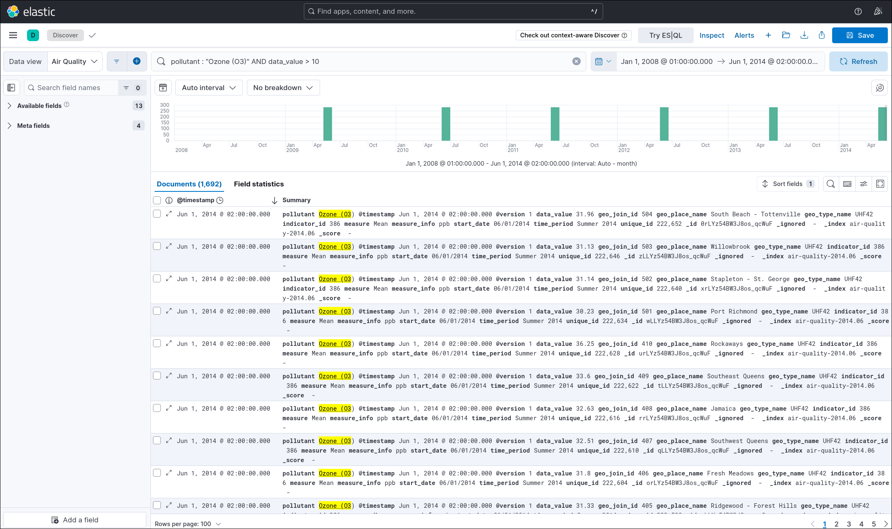
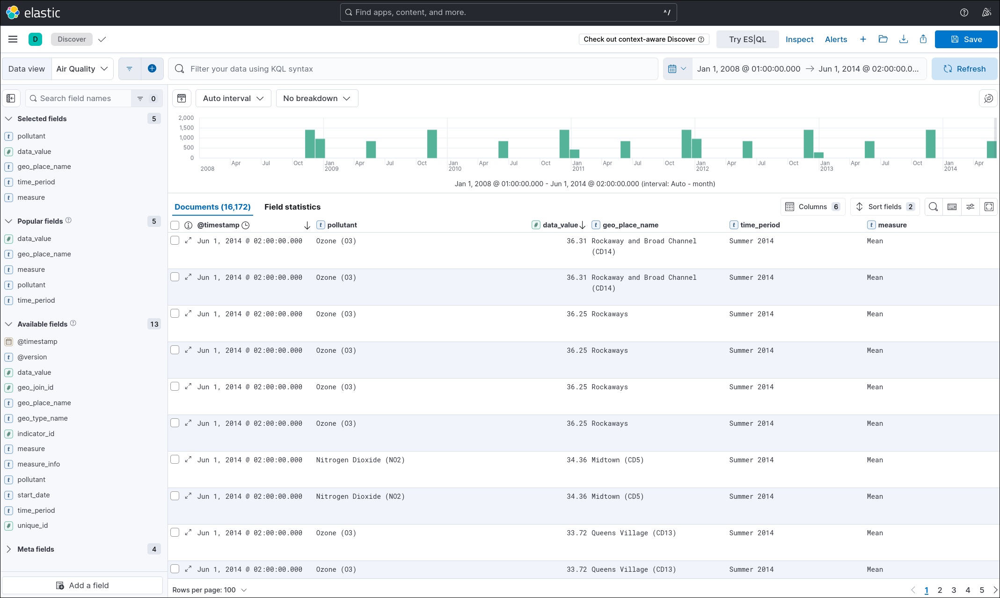
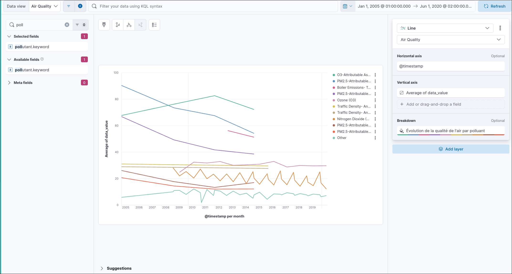
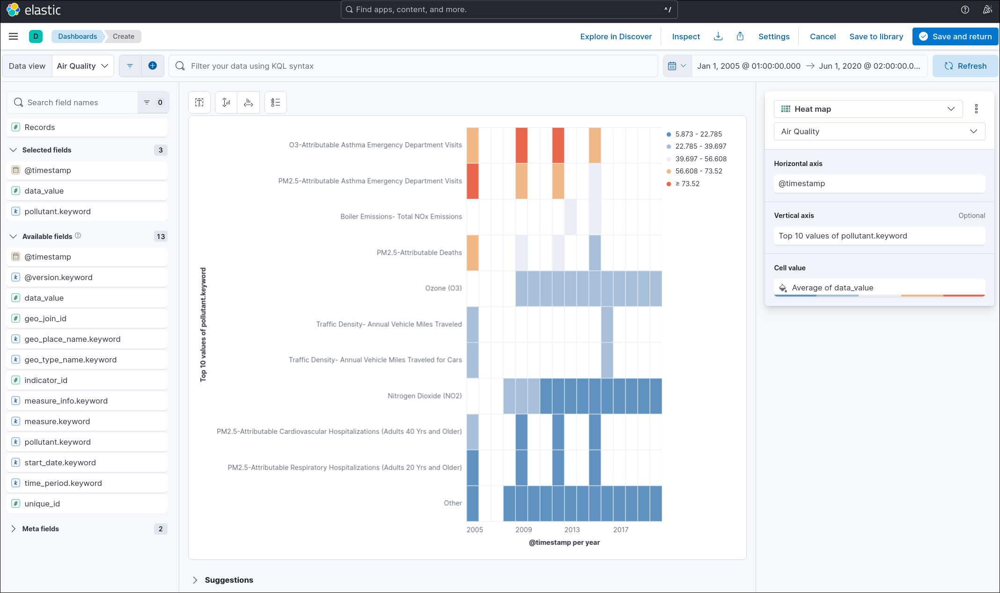
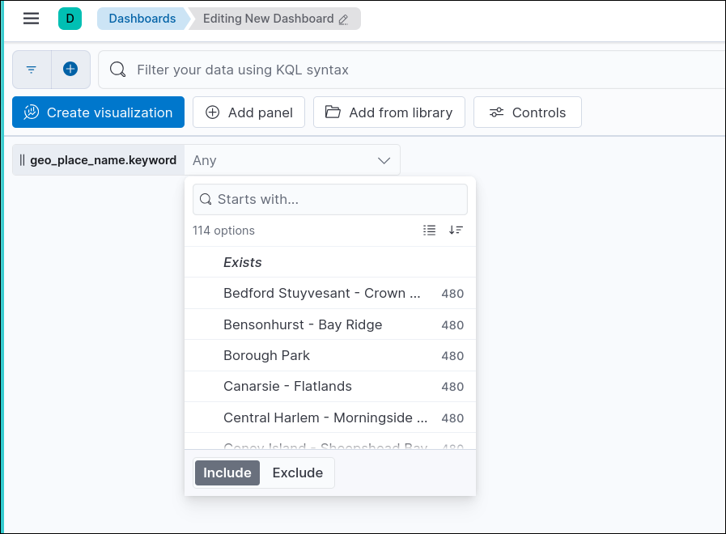
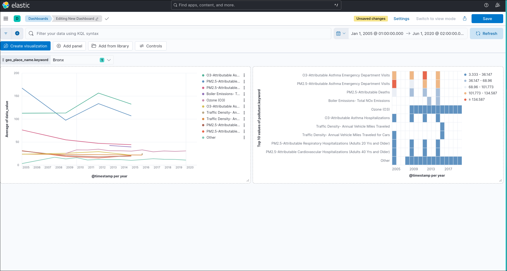
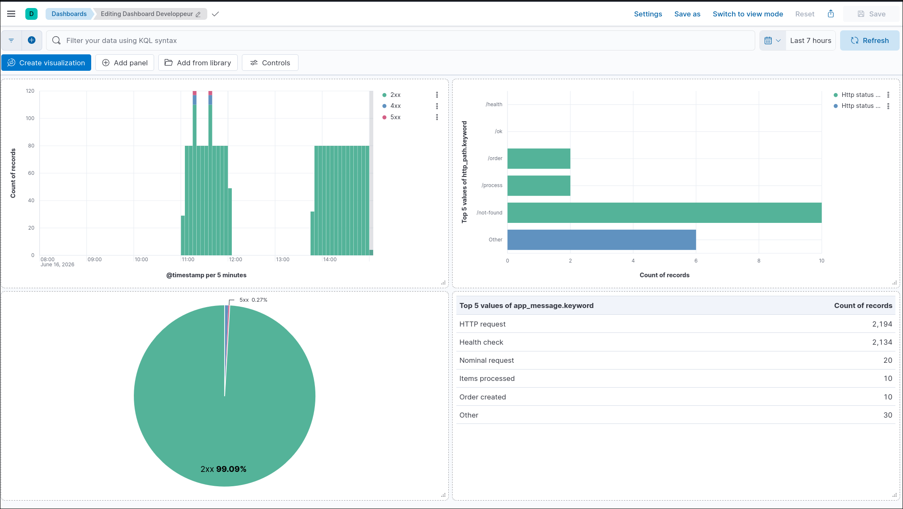
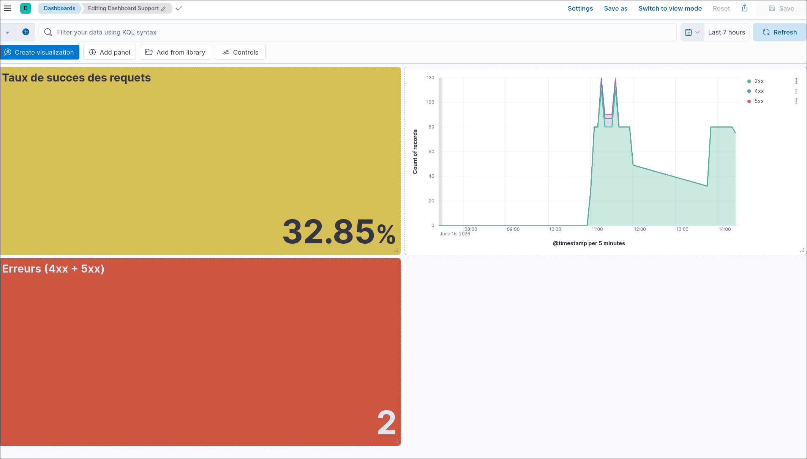

# TP ELK Stack — CECCARELLI Luca

## Procédure de déploiement

### 1) Construire les images Docker

```bash
# Depuis la racine du projet
# Image de l'application HTTP
docker build -t http-app:1.0.0 app/

# Image de l'importeur Air Quality
docker build -t air-quality-importer:1.0.0 air-quality-importer/
```

### 2) Créer le cluster kind

```bash
kind create cluster --config kind-cluster.yaml
```

### 3) Charger les images dans kind

```bash
kind load docker-image http-app:1.0.0 --name tp-elk
kind load docker-image air-quality-importer:1.0.0 --name tp-elk
```

### 4) Déployer tous les manifests

```bash
kubectl apply -f manifests/
```

### 5) Surveiller la convergence

```bash
# Suivre l'état de tous les pods en temps réel
kubectl get pods -n elk -w
```

> NB : Les pods mettent environ 9 minutes à se lancer dans le bon ordre et tout importer.
### 6) Vérifier l'état final

```bash
kubectl get all -n elk
```

---

## Accès aux services

| Service | URL |
|---|---|
| Application HTTP | http://localhost:8080 |
| Kibana | http://localhost:5601 |
| Elasticsearch (debug) | http://localhost:9200 *(non exposé — utiliser kubectl port-forward)* |

Pour accéder à Elasticsearch directement :
```bash
kubectl port-forward svc/elasticsearch 9200:9200 -n elk
```

---

## Génération des logs

```bash
# Lancer le script de génération de trafic
./generate-traffic.sh

# Ou avec une URL différente
./generate-traffic.sh http://localhost:8080
```

Ce script génère :
- **10 requêtes nominales** (`GET /ok`, `GET /health`)
- **5 commandes business** (`POST /order`, `POST /process`)
- **2 erreurs métier 400** (paramètres invalides)
- **5 erreurs client 404** (`GET /not-found`)
- **3 erreurs serveur 500** (`GET /error`)

Pour capturer un `request_id` spécifique et le rechercher dans Kibana :
```bash
# Les logs JSON sont sur stdout du pod, Filebeat les collecte
kubectl logs -l app=http-app -n elk --tail=20
```

---

## Import du dataset Air Quality

L'import est automatisé via le Job Kubernetes `06-air-quality-importer.yaml`.

Le fichier `datasets/Air_Quality.log` est monté dans le conteneur via `hostPath` (défini dans `kind-cluster.yaml`).

Pipeline : lecture CSV → parsing des champs → casting `data_value` en float → parsing `start_date` comme `@timestamp` → indexation dans `air-quality-YYYY.MM`.

```bash
# Relancer l'import (si nécessaire)
kubectl delete job air-quality-importer -n elk
kubectl apply -f manifests/06-air-quality-importer.yaml
```

---

## Structuration des logs applicatifs

Chaque ligne de log est émise en JSON sur stdout par `python-json-logger`.

Champs présents dans tous les logs :
| Champ | Type | Description |
|---|---|---|
| `@timestamp` | date | Horodatage ISO 8601 |
| `level` | keyword | `INFO`, `WARNING`, `ERROR` |
| `logger` | keyword | Nom du logger Python |
| `message` | text | Message lisible |

Champs enrichis par le middleware HTTP :
| Champ | Type | Description |
|---|---|---|
| `request_id` | keyword | UUID unique par requête |
| `http_method` | keyword | `GET`, `POST`, etc. |
| `http_path` | keyword | Route appelée |
| `http_status_code` | integer | Code HTTP retourné |
| `http_status_family` | keyword | `2xx`, `4xx`, `5xx` |
| `duration_ms` | float | Durée de traitement en ms |

Champs métier (selon la route) :
| Champ | Type | Description |
|---|---|---|
| `action` | keyword | `nominal`, `order_created`, `order_rejected`, `process_start`, `process_done`, `forced_error`, etc. |
| `order_id` | keyword | Identifiant de commande (ex. `ORD-A1B2C3D4`) |
| `product_id` | keyword | Identifiant produit |
| `items` | integer | Nombre d'items traités |

---

## Recherches Kibana principales

### Data View : `app-logs-*`

| Objectif | KQL |
|---|---|
| Toutes les erreurs serveur | `http_status_family : "5xx"` |
| Toutes les erreurs client | `http_status_family : "4xx"` |
| Logs ERROR et WARNING | `level : "ERROR" OR level : "WARNING"` |
| Par route | `http_path : "/error"` |
| Par request_id | `request_id : "xxxxxxxx-xxxx-xxxx-xxxx-xxxxxxxxxxxx"` |
| Requêtes lentes | `duration_ms > 200` |
| Commandes créées | `action : "order_created"` |
| Commandes rejetées | `action : "order_rejected"` |
| Recherche temporelle | Utiliser le sélecteur de temps Kibana |

### Data View : `air-quality-*`

| Objectif | KQL |
|---|---|
| Polluant + seuil | `pollutant : "Ozone (O3)" AND data_value > 10` |
| Par lieu | `geo_place_name : "Bronx"` |
| Pics de pollution 2008–2014 | Plage de temps + tri `data_value` desc |

#### Recherche combinée polluant + data_value + fenêtre temporelle



#### Champs utiles dans Discover, triés par `data_value` décroissant



#### Visualisation time-series : `Average(data_value)` par polluant



#### Heatmap comparaison période × polluant



#### Contrôle Options list sur `geo_place_name`



#### Filtre actif sur Bronx



---

## Description des dashboards

### Dashboard Développeur (`Developer Dashboard`)

Destiné à un développeur qui investigue un incident. Visualisations :
- **Timeline des erreurs** : ligne temporelle des requêtes 4xx et 5xx
- **Top routes en erreur** : bar chart `http_path` × `http_status_family`
- **Distribution des statuts** : pie chart des familles de statuts
- **Top messages d'erreur** : table `app_message` groupé par occurrence



### Dashboard Support (`Support Dashboard`)

Destiné à une équipe support ou métier, sans connaissance technique. Visualisations :
- **Taux de succès** : gauge `% requêtes 2xx / total`
- **Volume de requêtes** : area chart temporel
- **Nombre d'erreurs dernière heure** : compteur



### Dashboard Air Quality (`Air Quality Dashboard`)

- **Séries temporelles** : `Average(data_value)` par `pollutant` sur `@timestamp` (Lens)
- **Comparaison par période** : heatmap polluant × année
- **Contrôle interactif** : Options list sur `geo_place_name` (filtrer par quartier/zone, ex. Bronx)


---

## Hypothèses et limites

- **Elasticsearch single-node** : pas de réplication, données perdues si le pod redémarre (emptyDir).
- **Filebeat autodiscover** : collecte les logs de tous les pods du cluster. Le filtre `app: http-app` dans Logstash permet de séparer les logs applicatifs des logs système.
- **Import Air Quality idempotent** : Logstash `sincedb_path => /dev/null` force la relecture complète à chaque démarrage du Job. Pour éviter les doublons, supprimer l'index avant de relancer.
